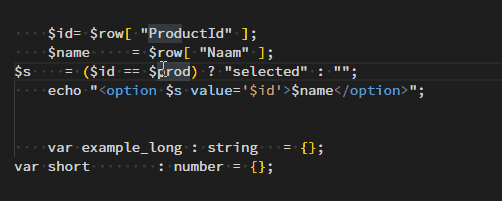

# Blockalign 

Align blocks of code similar to Vertical Align plugin for Sublime Text 3.
No need to select the block, it will auto-detect possible alignments. 

## Suggested keymap

[
   { "key": "ctrl+\\",           "command": "extension.blockalign",
                                 "when": "editorTextFocus" },
]

## For more information

https://github.com/crewone/vscode-blockalign
